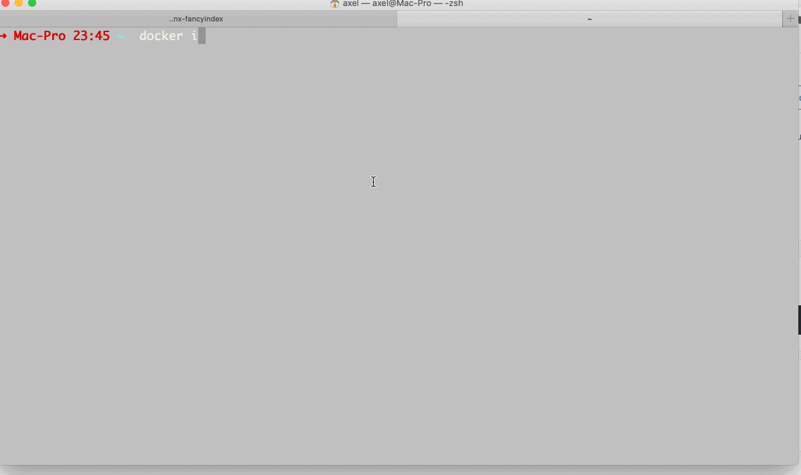
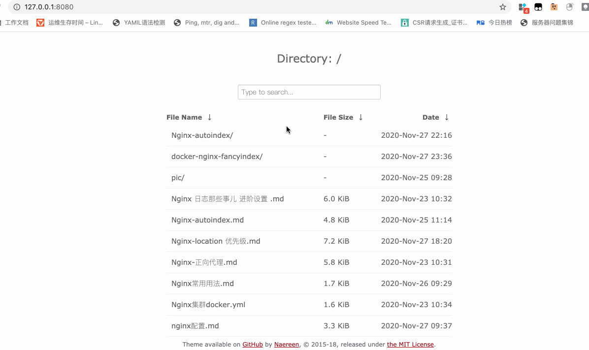
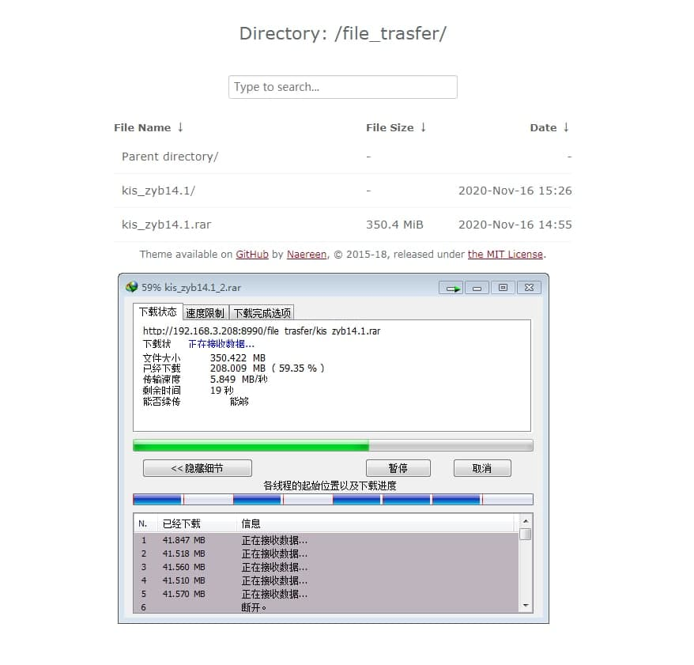

# Docker nginx fancyindex
For quick shared local directory with docker environment



## Include 
Base image: [nginx:1.18.0-alpine](https://github.com/nginxinc/docker-nginx/blob/3fb70ddd7094c1fdd50cc83d432643dc10ab6243/stable/alpine/Dockerfile)

Nginx moudle: [ngx-fancyindex](https://github.com/aperezdc/ngx-fancyindex)

Theme:[Nginx-Fancyindex-Theme](https://github.com/Naereen/Nginx-Fancyindex-Theme)

More info in `./dockerfile`
## Usage 
1.run it when u used it 
```
docker pull 
docekr run --name nginx-fancyindex -v /path/to/shared:/etc/nginx/shared -d nginx-fancyindex
```

2.modify nginx configuration
```
First run one for copy the default config file 
docker run --name nginx-fancyindex -p80:80 -d nginx-fancyindex
docekr cp nginx-fancyindex:/etc/nginx /path/to/save
```

## F&Q
> How to changed the theme ?

Replace file `/etc/nginx/theme/Nginx-Fancyindex-Theme-light`

> How to add nginx ldap user auth or ip whitelist ?

`/etc/nginx/conf.d/autoindex.conf`

Only download limit by default，More info u can in `./autoindex.conf`




## Last
IF u dont have docker installed try docker !LOL
> python -m http.server 

At last thx [Compiling NGINX module as dynamic module for use in docker](https://gist.github.com/hermanbanken/96f0ff298c162a522ddbba44cad31081) helpd a lot !
